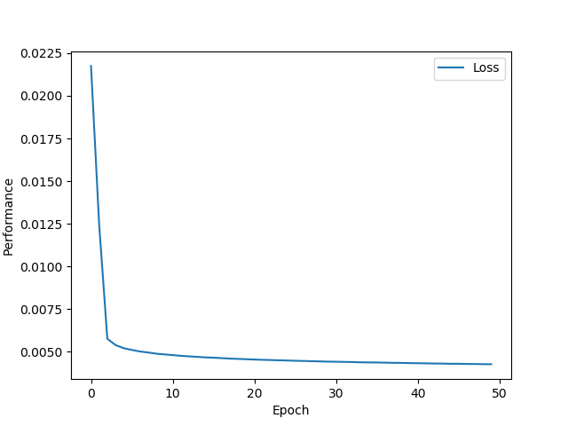
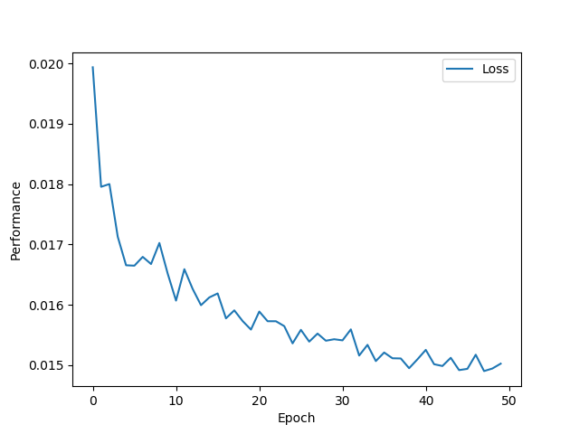
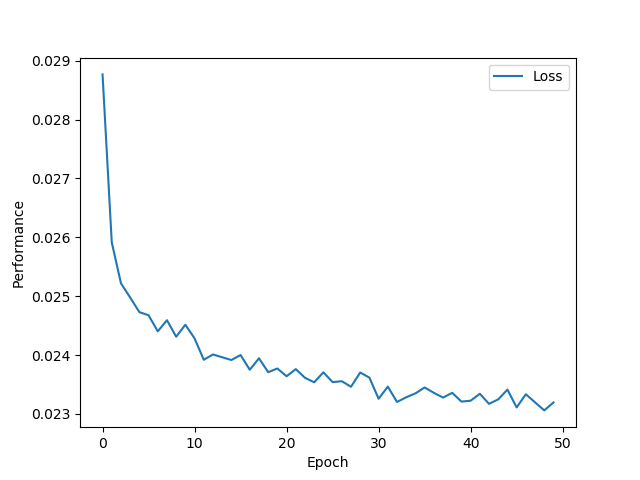
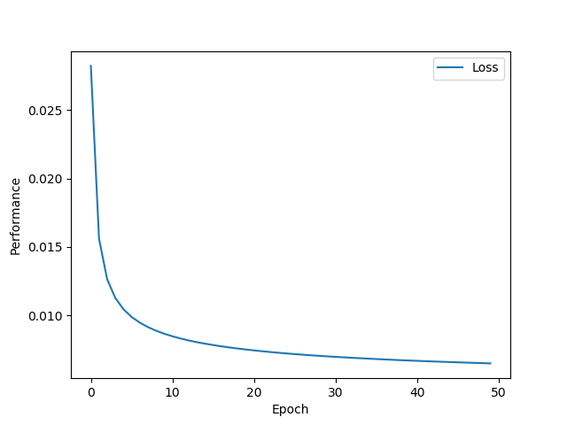

## Weekly Homework 6

##### Dalton Rothenberger

### Adagrad

Accuracy = 0.9112, Loss = 0.0085

### Adam

Accuracy = 0.8433, Loss = 0.0151

### RMSprop

Accuracy = 0.7562, Loss = 0.0234

### SGD

Accuracy = 0.911, Loss = 0.0085 

All these optimization algorithms were run under the same conditions which were:

Data = Normalized, Loss = MSLE, Activation = Softmax, Batch Size = 32, Epochs = 50, Learning Rate = 0.1

It was interesting to see that the optimization algorithms returned such different results. Both SGD and Adagrad were smooth graphs but RMSprop and Adam were jagged and bounced around. The two smooth algorithms performed the best out of the bunch that I tested and had nearly the exact same results. SGD and Adagard performed best for this data set. 

